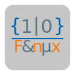

    

<h1>SCDF</h1>

## Présentation

### Qu'est-ce que c'est ?

SCDF est une librairie définissant un format de fichier de données et permettant ainsi de le parser.
L'utilisation est simplifiée et une documentation Doxygen est présente dans le code (également compilée).

### Que signifie SCDF ?

SCDF est l'acronyme de Simple and Configurable Data File.

### Format de fichier

Le format de fichier SCDF est très simple (comparable aux .ini de Windows). Cependant les catégories ne comportent plus de crochets mais des accolades, les tableaux sont supportés et une configuration est implémentée au début du fichier (Voir documentation). Ainsi un fichier type serait:

    -TCF

    ; Commentaire d'exemple

    {Inf}
        test_val = 'value1'
    {Infos}
        test_nbr = 16
        test_tab = [val1, val_2, 0]
        test_val = 'value'

## Compatibilité

La librairie SCDF est multi-système (comme tous les outils Ashes), à condition de posséder un compilateur "GCC like" (Exemple: MinGW).

## Licence

La librairie SCDF est sous licence GPL V3. Celle-ci est appliquée à chaque fichier et peut être consultée via le document COPYING.

## Comment l'installer ?

### Dépendances

Une seule dépendance est nécessaire pour compiler libSCDF:

* AScripts

Celle-ci peut être clonée et installée via mon github.

### Installation

Vous pouvez tout simplement executer les commandes suivantes:

    make
    make install

À noter que le dossier d'installation est défini par la variable d'envirronement ASHES_DIR (créée lors de l'installation d'AScripts).
